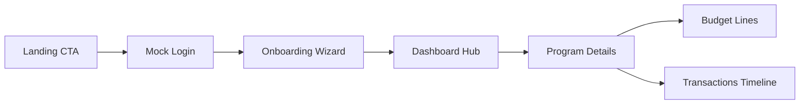

# Plan: Budget Management Frontend for Cameroon Nonprofits

## 1. Stack & Workspace Blueprint
- **Frontend**: Vite + React 18 + TypeScript for fast DX, React Router for marketing/app routes, React Query for async data states.
- **Styling**: Tailwind CSS + Tailwind UI component packs, custom theme tokens derived from NGO palette.
- **Tooling**: ESLint + Prettier, Vitest + Testing Library for component coverage, MSW for component testing even though runtime uses Express mock.
- **Backend placeholder**: Express server with CORS + Helmet, serving static JSON from `/data` folder; hot reload via nodemon.

### Directory Layout
- `/apps/web`: Vite React app (src with routes, components, features).
- `/apps/mock-server`: Express server exposing REST endpoints backed by JSON fixtures.
- `/packages/ui` (optional future): shared design tokens if we split marketing/app shells.
- Root `package.json` with scripts: `dev:web`, `dev:server`, `dev:all` (concurrently).

## 2. Visual Identity Tokens
- **Palette**:
  - Primaries: Deep Ocean `#0F3D5C`, Teal Accent `#1BA8A4`.
  - Support: Mist `#E1F0F4`, Sandstone `#F2E9E4`, Charcoal `#0B1E2D`.
- **Gradients**: Linear blend from `#0F3D5C` to `#1BA8A4` for hero background.
- **Typography**:
  - Headings: Space Grotesk (600).
  - Body/UI: Inter (400/500).
- **Iconography**: Outline icons with rounded corners (Lucide).
- **Imagery**: Soft blue overlays on photography of community programs in Cameroon.
- **Copy tone**: French-first, confident and supportive (e.g., "Pilotez vos programmes avec transparence").

## 3. Single-Page Marketing Experience
1. **Hero**: Headline, subcopy, CTA button linking to /login anchor, background gradient, NGO stats.
2. **Impact Metrics**: 3 cards (programmes financés, bénéficiaires, taux de transparence).
3. **Feature Highlights**: Zig-zag layout describing onboarding, suivi budgétaire, rapports donors.
4. **Testimonials**: Carousel using Tailwind UI testimonial grid featuring francophone NGOs.
5. **CTA Strip**: Solid teal block with contact email + button leading to login.

## 4. Onboarding Journey
1. **Organisation**: Collect name, localisation, devise par défaut, exercice fiscal.
2. **Programmes annuels**: Form to add program name, objectifs, budget initial.
3. **Catégories budgétaires**: Pre-seed recommended categories (Personnel, Logistique, Sensibilisation) with ability to edit.
4. **Résumé**: Review screen before entering dashboard, show progress indicator at top.

## 5. Dashboard Modules
- **Top KPI cards**: Budget total, dépenses engagées, solde restant.
- **Programme table**: Each programme with budget vs réel, status pill.
- **Budget vs Réel chart**: Combined bar/line chart per month.
- **Transactions timeline**: List grouped by month with tags (Revenu/Dépense).
- **Alerts panel**: Warnings when dépenses dépassent 80% d un poste.

## 6. Mock Email/Password Auth
- Simple form validating email format + min password length.
- On submit, call mock `POST /auth/login`.
- Store faux session in context (no storage) and route to /app.
- Provide error banner on 401 (simulate invalid credentials).

## 7. Data Model & Sample Records
- **Organization**: `id, name, currency, fiscalYearStart, fiscalYearEnd`.
- **Program**: `id, organizationId, title, owner, annualBudget, spentToDate, description`.
- **BudgetLine**: `id, programId, category, allocated, spent, notes`.
- **Transaction**: `id, programId, type (income|expense), amount, vendor, date, note`.
- **ImpactMetric**: `id, label, value, unit, trend`.
- Provide sample JSON fixture per entity for Express server and onboarding defaults.

## 8. Express Mock API Contract
| Endpoint | Method | Purpose | Response |
| --- | --- | --- | --- |
| /auth/login | POST | Validate mock creds | { token, user } |
| /organizations/:id | GET | Fetch org profile | Organization |
| /organizations/:id/programs | GET | List programs | Program[] |
| /programs/:id/budget-lines | GET | Budget lines | BudgetLine[] |
| /programs/:id/transactions | GET | Transaction timeline | Transaction[] |
| /metrics | GET | Marketing KPIs | ImpactMetric[] |
- Add artificial latency (300ms) to mimic network.
- Use middleware to inject CORS headers for Vite dev server.

## 9. Frontend Data Layer
- Create `src/services/apiClient.ts` with axios instance pointing to Express URL.
- Feature-specific hooks (React Query): `useOrganization`, `usePrograms`, `useBudgetLines(programId)`, `useTransactions(programId)`, `useMetrics`.
- Keep mock auth state in `AuthContext` with provider gating /app routes.
- Seed offline fallback by hydrating query cache from fixture JSON for storybook/demos.

## 10. Tailwind UI Component Mapping
- Marketing: Hero pattern "Split with screenshot", Stats section "Simple three column", Testimonial "With avatars".
- App shell: "Sidebar with header" layout, "Stacked list with badges" for transactions, "Cards with charts" for KPIs.
- Customize via Tailwind config (extend colors, fontFamily, boxShadow).

## 11. Demo & Testing Scenarios
- **Seed script**: npm run seed to copy fixture JSON into mock-server /data.
- **Demo route**: Query param `?program=education` preselects programme in dashboard.
- **Testing**: Vitest + React Testing Library for components, supertest for Express endpoints.
- **Future hooks**: keep API responses versioned to ease later real backend swap (wrap in adapter).

## 12. Experience Flow Diagram

## Next Steps
1. Validate this plan with stakeholders.
2. Switch to code mode to scaffold workspace and implement marketing + app shells against mock API.
3. Iterate on visual QA with Tailwind UI and localized French content.