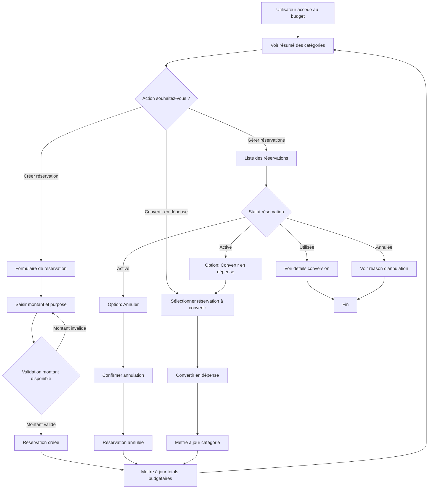
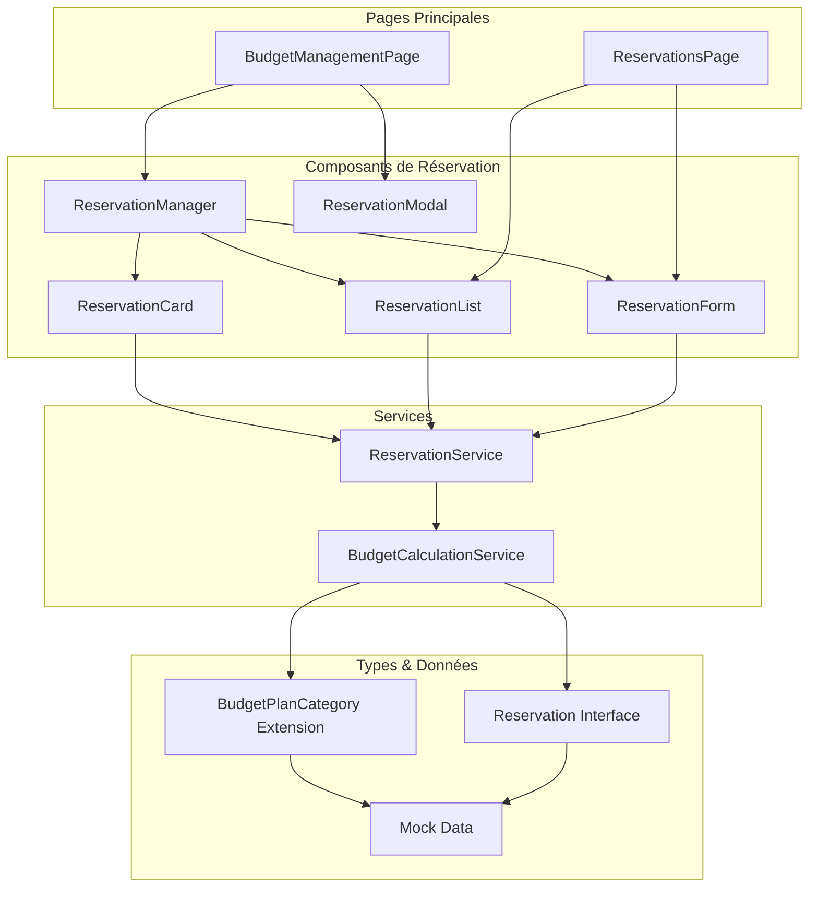
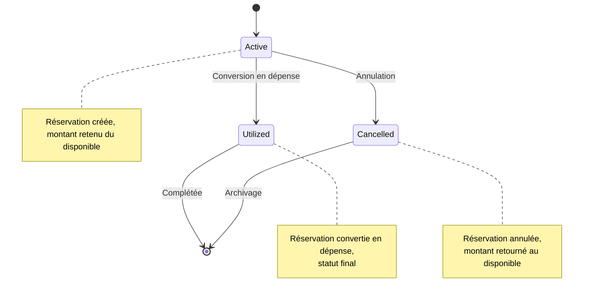

# Maquettes du Module de Réservation de Crédits

## 1. Flux de Processus des Réservations



## 2. Architecture des Composants



## 3. Structure de Données

```mermaid
erDiagram
    BudgetPlanCategory ||--o{ Reservation : contains
    Reservation }o--|| User : reserved_by
    Reservation }o--|| Transaction : converts_to
    
    BudgetPlanCategory {
        string id
## 4. Maquettes d'Interface

### 4.1 BudgetManagementPage - Vue Intégrée

```
┌─────────────────────────────────────────────────────────────┐
│ [HEADER: Gestion des budgets - Plan de contingence 2026]   │
├─────────────────────────────────────────────────────────────┤
│ [Métriques] Budget Global | Objectifs | Réserves Disponibles│
│            98M XAF         | 3 objectifs | 14M XAF        │
├─────────────────────────────────────────────────────────────┤
│ [Tableau des Catégories]                                    │
│ ┌─────────────────────────────────────────────────────────┐ │
│ │ Catégorie │ Responsable │ Alloué │ Utilisé │ Réservé │    │   │ Actions │
│ │ Réponse   │ Clarisse E. │ 22M    │ 4M      │ 2M [+]  │    │   │ [Éditer] │
│ │ rapide    │             │        │         │         │    │   │ [Réserver]│
│ ├─────────────────────────────────────────────────────────┤ │
│ │ Pont      │ Agnès M.    │ 26M    │ 6M      │ 5M [+]  │    │   │ [Éditer] │
│ │ éducatif  │             │        │         │         │    │   │ [Réserver]│
│ └─────────────────────────────────────────────────────────┘ │
│                                                                 │
│ [+ Ajouter une ligne] [Gérer les réservations]                 │
└─────────────────────────────────────────────────────────────┘
```

### 4.2 ReservationModal - Création/Édition

```
┌─────────────────────────────────────────────────────────────┐
│ ✕                    Nouvelle Réservation                     │
├─────────────────────────────────────────────────────────────┤
│ Catégorie:     [Réponse rapide ▼]                           │
│ Montant:       [2,000,000    ] XAF                         │
│ Purpose:       [Déploiement clinique mobile Nord        ]   │
│                (Champ multiligne)                            │
│ Notes:         [Achat véhicules + équipement médical   ]   │
│                                                                │
│ Disponible après réservation: 16,000,000 XAF                  │
│                                                                │
│ [Annuler]                           [Créer Réservation]      │
└─────────────────────────────────────────────────────────────┘
```

### 4.3 ReservationsPage - Vue Détaillée

```
┌─────────────────────────────────────────────────────────────┐
│ [HEADER: Gestion des Réservations]                           │
├─────────────────────────────────────────────────────────────┤
│ [Filtres: Toutes ▼] [Statut: Actif ▼] [Exporter CSV]        │
├─────────────────────────────────────────────────────────────┤
│ ┌─ Réservation Active ──────────────────────────────┐      │
│ │ 💰 2,000,000 XAF - Réponse rapide                 │      │
│ │ Par: Clarisse Ebode | 05/12/2025                  │      │
│ │ Purpose: Déploiement clinique mobile Nord        │      │
│ │ [Convertir en dépense] [Annuler]                 │      │
│ └───────────────────────────────────────────────────┘      │
│                                                               │
│ ┌─ Réservation Utilisée ────────────────────────────┐      │
│ │ ✅ 5,000,000 XAF - Pont éducatif                  │      │
│ │ Par: Agnès Mbarga | 02/12/2025                    │      │
│ │ Purpose: Bourses scolaires S2                     │      │
│ │ Convertie le: 04/12/2025                          │      │
│ └───────────────────────────────────────────────────┘      │
└─────────────────────────────────────────────────────────────┘
```

### 4.4 Formulaire de Conversion

```
┌─────────────────────────────────────────────────────────────┐
│ ✕               Convertir Réservation en Dépense             │
├─────────────────────────────────────────────────────────────┤
│ Réservation:    Déploiement clinique mobile Nord           │
│ Montant:        2,000,000 XAF                              │
│                                                                │
│ Type:           [Dépense ▼]                                │
│ Vendor:         [Clinique du Nord SARL               ]      │
│ Date:           [06/12/2025    ]                           │
│ Notes:          [Facture #2025-12-003                 ]     │
│                                                                │
│ [Annuler]                              [Confirmer Conversion] │
└─────────────────────────────────────────────────────────────┘
```

## 5. Calculs et Indicateurs

### 5.1 Formules de Calcul

```
Disponible = Alloué - Utilisé - Réservé
Taux d'engagement = (Utilisé + Réservé) / Alloué * 100
Réserve globale = Somme des montants non engagés
```

### 5.2 Indicateurs Visuels

```
🟢 Disponible (> 20% du budget alloué)
🟡 Attention (10-20% du budget alloué)  
🔴 Critique (< 10% du budget alloué)
```

## 6. États et Transitions



## 7. Spécifications Techniques

### 7.1 Endpoints API Simulés

```typescript
// Création de réservation
POST /api/reservations
{
  "planId": "plan-2025",
  "categoryId": "cat-education", 
  "amount": 2000000,
  "purpose": "Déploiement clinique mobile Nord",
  "notes": "Achat véhicules + équipement médical"
}

// Conversion en dépense
PUT /api/reservations/{id}/utilize
{
  "transactionType": "expense",
  "vendor": "Clinique du Nord SARL",
  "date": "2025-12-06",
  "notes": "Facture #2025-12-003"
}

// Annulation
PUT /api/reservations/{id}/cancel
{
  "reason": "Projet annulé"
}
```

### 7.2 Structure des Données Mock

```typescript
export const mockReservations: Reservation[] = [
  {
    id: "res-001",
    planId: "plan-2025",
    categoryId: "draft-rapid-response",
    amount: 2000000,
    purpose: "Déploiement clinique mobile Nord",
    reservedBy: "Clarisse Ebode",
    reservedDate: "2025-12-05T10:30:00Z",
    status: "active",
    notes: "Achat véhicules + équipement médical"
  },
  {
    id: "res-002", 
    planId: "plan-2025",
    categoryId: "draft-education-bridge",
    amount: 5000000,
    purpose: "Bourses scolaires S2",
    reservedBy: "Agnès Mbarga",
    reservedDate: "2025-12-02T14:15:00Z",
    status: "utilized",
    utilizedDate: "2025-12-04T09:20:00Z",
    notes: "120 bourses d'études"
  }
];
```

Cette maquette complète montre une implémentation professionnelle du module de réservation, adaptée aux besoins spécifiques des ONG camerounaises avec une interface intuitive, des calculs précis et une gestion d'état robuste.
        string label
        string owner
        number allocated
        number utilized
        number reserved
        string notes
    }
    
    Reservation {
        string id
        string plan_id
        string category_id
        number amount
        string purpose
        string reserved_by
        datetime reserved_date
        string status
        datetime utilized_date
        string cancellation_reason
        string notes
    }
    
    User {
        string id
        string name
        string email
    }
    
    Transaction {
        string id
        string program_id
        string type
        number amount
        string vendor
        datetime date
    }