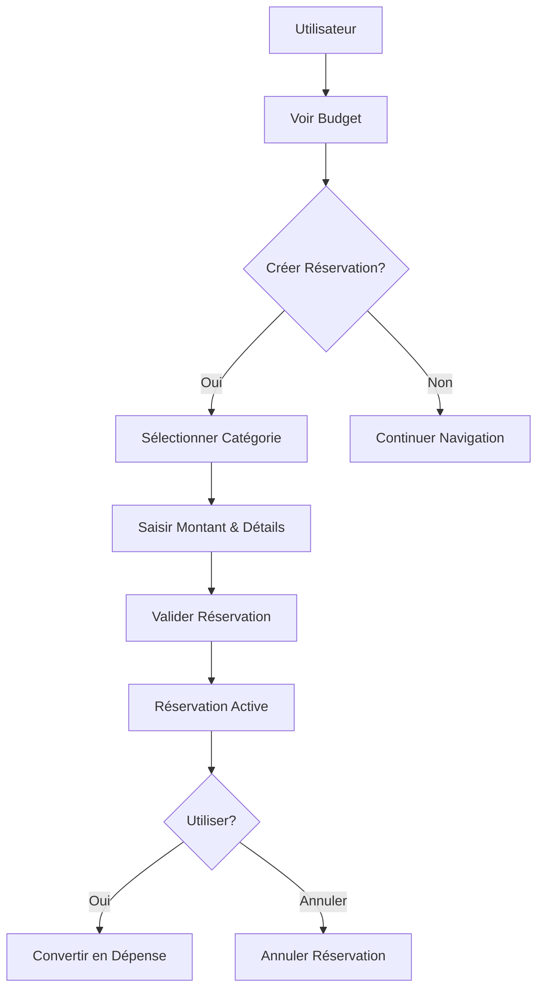

# Plan: Implémentation de la Réservation de Crédits

## Contexte et Définition
La "Réservation de Crédits" dans le contexte de la gestion budgétaire des ONG camerounaises fait référence au processus de réservation préalable de fonds budgétaires pour des dépenses planifiées. Cela permet de garantir que les crédits sont mis de côté avant leur utilisation effective, évitant les dépassements et améliorant la transparence budgétaire.

## Fonctionnalités Clés
1. **Création de Réservations**: Permettre aux utilisateurs de réserver des montants spécifiques pour des catégories budgétaires données.
2. **Suivi des Réservations**: Afficher les réservations actives, utilisées ou annulées.
3. **Calcul des Disponibilités**: Mettre à jour les calculs budgétaires pour tenir compte des réservations (Disponible = Alloué - Utilisé - Réservé).
4. **Conversion en Dépenses**: Permettre de convertir une réservation en dépense effective.
5. **Annulation de Réservations**: Possibilité d'annuler des réservations non utilisées.

## Structure de Données Proposée

### Extension de BudgetPlanCategory
Ajouter un champ `reserved` à l'interface existante pour un calcul simple des montants réservés.

```typescript
export interface BudgetPlanCategory {
  id: string;
  label: string;
  owner: string;
  allocated: number;
  utilized: number;
  reserved: number; // Nouveau champ
  notes?: string;
}
```

### Nouvelle Entité Reservation (Option Avancée)
Pour un suivi plus détaillé, créer une entité séparée :

```typescript
export interface Reservation {
  id: string;
  planId: string;
  categoryId: string;
  amount: number;
  purpose: string;
  reservedBy: string;
  reservedDate: string;
  status: "active" | "utilized" | "cancelled";
  utilizedDate?: string;
  notes?: string;
}
```

## Flux Utilisateur


## Intégration avec l'Interface Existante
- Ajouter une colonne "Réservé" dans le tableau des catégories budgétaires
- Afficher le montant disponible réel (Alloué - Utilisé - Réservé)
- Ajouter un bouton "Réserver Crédits" pour les plans brouillon
- Créer une section dédiée pour gérer les réservations détaillées

## Calculs Budgétaires Mis à Jour
- **Taux d'Utilisation**: (Utilisé + Réservé) / Alloué
- **Réserves Disponibles**: Alloué - Utilisé - Réservé
- **Engagé dans ExecutionEntry**: Inclure les réservations actives

## Étapes d'Implémentation
1. Étendre les types TypeScript
2. Mettre à jour les données mock
3. Modifier les composants UI existants
4. Ajouter la logique de gestion des réservations
5. Tester l'intégration complète

## Avantages
- Meilleure visibilité sur les engagements budgétaires
- Prévention des dépassements
- Suivi précis des réservations vs dépenses réelles
- Conformité aux normes de gestion budgétaire des ONG

Cette proposition s'intègre parfaitement avec l'architecture existante tout en ajoutant une fonctionnalité essentielle pour la gestion budgétaire professionnelle.